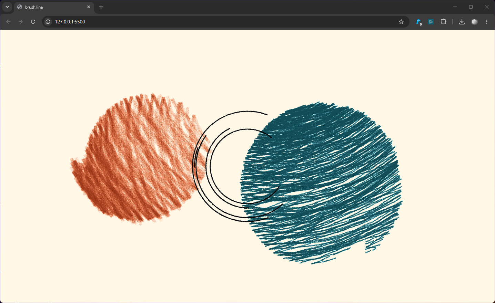

# brush.line

Atelier de creative coding par Nicolas Tilly

Intervention le 3 juin 2026 avec les DNMADe 2 Design interactif spé CREATIVE CODING à Gobelins.

---

**Contenu** : Cet atelier propose d’aborder le creative coding comme une pratique de dessin sensible, où le code devient un geste, inspiré de celui du dessin, plutôt qu’un simple outil technique. À travers la librairie p5.brush, il s’agit d’explorer une écriture graphique faite de traces, d’accidents et de variations, où l’imprévu renvoie aux aventures du trait sur une feuille de papier. Le code n'est plus seulement une matière logique : il devient matière à poésie graphique, révélant une forme de dessin vivant et animé, entre contrôle et lâcher-prise.

**Notions abordées** : code créatif, dessin numérique, langage graphique, aléatoire, hybridation, variation, sensibilité numérique, image animée

